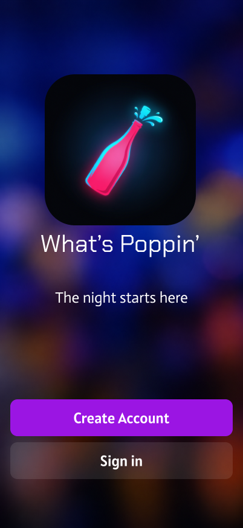
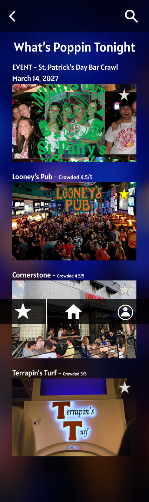
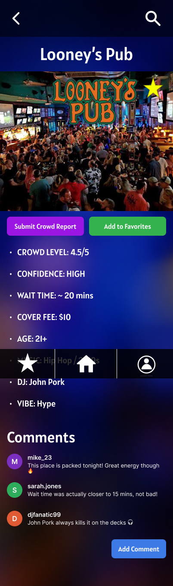
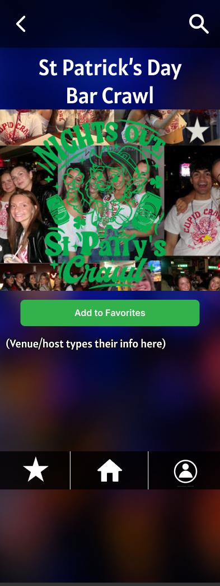
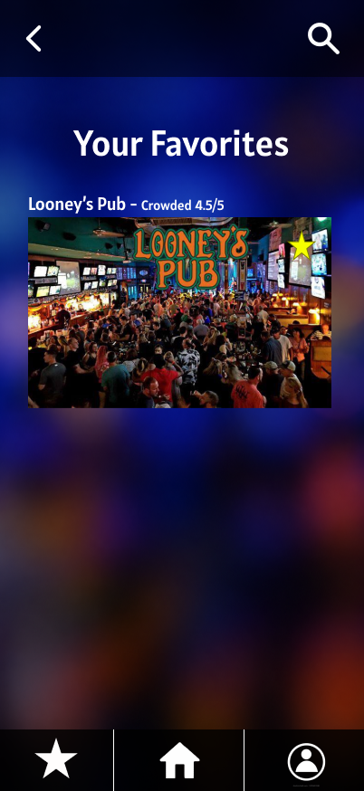
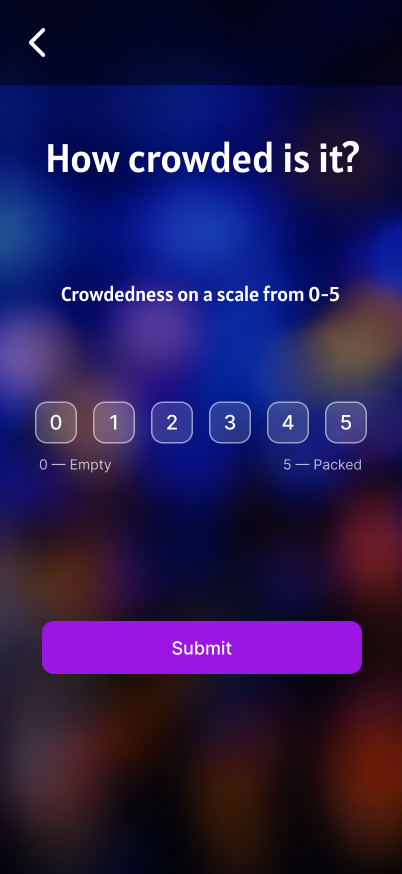
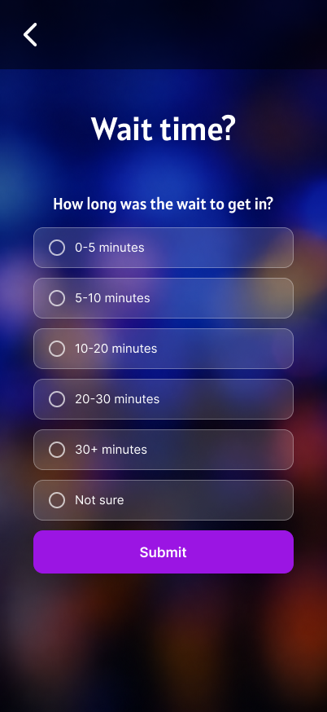
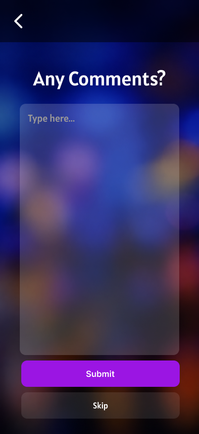

# WhatsPoppin

A real-time nightlife discovery platform for the DMV

## Features coming

- Real-time crowd reporting
- Venue discovery
- Events and promotions
- Historical crowd trends
- Venue accounts

## Planned Tech Stack

Frontend:
React Native / Expo

Backend:
Django REST Framework

Database:
PostgreSQL

## UI/UX Design

The initial UI/UX was designed in Figma before development

[View Interactive Figma Prototype](https://www.figma.com/design/jA8Q45vkIckb0IjsxjSkwS/WhatsPoppin-mock-UI?node-id=0-1&t=KleW9YpNphBqFnZo-1)

### Screenshots

Loading Screen

Welcome Page

Register Page

Sign in Page

Home Page

Venue Page

Event Page

Favorites Page

Reports pages

Profile page

