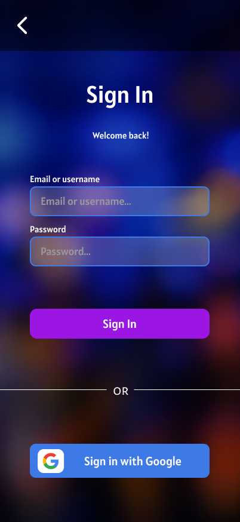

# WhatsPoppin

A mobile app about real-time nightlife discovery for College Park Maryland.

Users will be able to find the perfect place in College Park to spend their night!

## Key features

- Real-time crowd reporting
- Venue discovery
- Events and promotions
- Historical crowd trends
- Venue accounts

## Tech Stack

Frontend:
React Native / Expo

Backend:
Django REST Framework

Database:
PostgreSQL

## UI/UX Design

The initial UI/UX was designed in Figma before development

[View Interactive Figma Prototype](https://www.figma.com/design/jA8Q45vkIckb0IjsxjSkwS/WhatsPoppin-mock-UI?node-id=0-1&t=KleW9YpNphBqFnZo-1)

### Screenshots

Loading Screen


Welcome Page


Authentication Pages




Home Page


Venue Page


Event Page


Favorites Page


Reports pages


Profile page


## Repository structure

```text
WhatsPoppin/
├── backend/          Django project and apps
│   ├── config/       Project settings and URL routing
│   ├── users/        Accounts
│   ├── venues/       Bars and clubs
│   ├── events/       Events at a venue
│   ├── reports/      Crowd and wait-time reports
│   ├── favorites/    Saved venues
│   ├── manage.py
│   └── requirements.txt
├── design/           Figma screen exports
├── frontend/         Expo app for iOS, Android, and web
├── .env.example      Placeholder environment variables
└── .venv/            Local Python virtual environment (not committed)
```

The Expo app includes Nearby, map/list views, venue details, search, saved spots,
quick crowd reporting, and a profile with report history. The original Figma
exports remain in `design/`.

## Run the app preview

Node.js 22.13 or newer is required. From the repository root:

```powershell
cd frontend
npm install
npm run web
```

Open [the mobile app demo](http://localhost:8081). The browser demo keeps a mobile canvas (up to 480 px wide), while the native app adapts to the actual phone or tablet screen. For a compatible Expo Go app on
a phone, run `npm start` and scan the QR code. A physical device must be on the
same network as the computer. Windows cannot run the iOS simulator; use a
physical iPhone or build on macOS.

Without `EXPO_PUBLIC_API_URL`, the app runs in **sample preview mode**. Crowd
reports, business details, locations, and photos are illustrative, not live
business information. Saves and new sample reports persist on this device.
They are never sent to the backend. Pull to refresh does not fabricate newer
reports; existing reports become stale naturally.

The interface uses four crowd levels: Quiet, Moderate, Busy, and Packed. The
latest report determines the displayed level. Agreement is calculated from
reports in the last 30 minutes. Older levels display **Needs update**. The
original backend scale remains compatible: 0–1 → Quiet, 2 → Moderate,
3–4 → Busy, 5 → Packed. Wait time is optional.

Web maps use OpenStreetMap tiles and retain attribution. Native maps use
`react-native-maps`. Configure a Google Maps API key in Expo's Android config
for standalone Android builds. Venue photography and web tiles require a
network connection; photo failures show a neutral fallback.

## Connect the Django API

Complete the backend setup below, including migrations and `seed_dev_data`.
Then create `frontend/.env` from `frontend/.env.example` and set:

```dotenv
EXPO_PUBLIC_API_URL=http://127.0.0.1:8000/api
```

Restart Expo after changing environment variables. For a physical phone, use
the computer's LAN IP, run Django with `python manage.py runserver 0.0.0.0:8000`,
and add that LAN IP to `ALLOWED_HOSTS` in the root `.env`. For an Android
emulator, `10.0.2.2` reaches the host machine. Add the browser's exact origin to
`CORS_ALLOWED_ORIGINS` when using a different host or port.

Browse venues as a guest. Sign in from **You** using a seeded account to save
venues and report crowds. The app does not silently substitute sample data if
the API is unavailable. Native credentials are kept in Expo SecureStore;
browser credentials last for the tab session. Sign-out revokes the API token.
Account registration and password recovery are not implemented; accounts can
be created through Django admin. Use HTTPS for a deployed API.

Available API endpoints:

| Method | Endpoint | Purpose |
| --- | --- | --- |
| GET | `/api/venues/` | Public venues and latest reports |
| POST | `/api/auth/sign-in/` | Username/password → token |
| POST | `/api/auth/sign-out/` | Revoke token |
| POST | `/api/reports/` | Authenticated crowd report |
| GET | `/api/reports/mine/` | Your report history |
| GET | `/api/favorites/` | Your saved venue IDs |
| PUT / DELETE | `/api/favorites/<id>/` | Save / unsave a venue |

## Verification

```powershell
cd frontend
npm run typecheck
npm test
npm run build:web
cd ../backend
../.venv/Scripts/python.exe manage.py test --settings=config.test_settings
```

The test settings use an isolated SQLite test database, without changing
PostgreSQL defaults or requiring local credentials. For optional local
backend development without PostgreSQL, set `USE_SQLITE=1` in the root `.env`
alongside `DJANGO_SECRET_KEY` and `DEBUG=True`, then migrate normally.

The browser preview is visually checked at 320, 375, 414, and 768 px, plus
desktop. Native device builds still need device QA and release signing before
store submission. `npm audit` currently reports inherited Expo/Metro dependency
advisories; its proposed forced fixes downgrade Expo to SDK 44 and are not
compatible with this project. TypeScript 7 is used because the SDK-recommended TypeScript 6 compiler recurses on the native screen types; Expo may report that development-tool version difference. Review upstream patches before a production
release.

## Backend setup

The backend uses Python, Django 5.2, Django REST Framework, and PostgreSQL. Django 5.2 is the long-term support release and works with the Python 3.14 install used for this project.

### Python virtual environment

From the repository root:

```powershell
python -m venv .venv
.\.venv\Scripts\Activate.ps1
```

On macOS or Linux, activate it with `source .venv/bin/activate`.

### Dependency installation

With the virtual environment activated:

```powershell
pip install -r backend\requirements.txt
```

### PostgreSQL configuration

PostgreSQL 18 is already installed on this machine as the `postgresql-x64-18` service. Create a database and login role for the app. The easiest way is pgAdmin. From `psql`, connect as the PostgreSQL admin user and run the statements below.

`psql` is not on the system PATH. On this install it lives here:

```powershell
& "C:\Program Files\PostgreSQL\18\bin\psql.exe" -U postgres -h localhost -d postgres
```

```sql
CREATE USER whatspoppin WITH PASSWORD 'choose-a-password';
CREATE DATABASE whatspoppin OWNER whatspoppin;
```

Use that password only in your local `.env` file.

### .env setup

From the repository root:

```powershell
Copy-Item .env.example .env
```

Edit `.env` and replace every placeholder. `DJANGO_SECRET_KEY` can be any long random string. Generate one with:

```powershell
.\.venv\Scripts\python.exe -c "import secrets; print(secrets.token_urlsafe(50))"
```

`.env` is ignored by Git. `.env.example` contains placeholders only.

### Migration commands

From the `backend` directory, with the virtual environment activated and `.env` filled in:

```powershell
python manage.py migrate
python manage.py seed_dev_data
python manage.py createsuperuser
```

`seed_dev_data` loads fictional College Park sample data. The sample usernames are `sample_alex`, `sample_jordan`, and `sample_riley`. Their shared development password is `sample-password`. These are not real accounts.

### Development server

From the `backend` directory:

```powershell
python manage.py runserver
```

The admin site is at [http://127.0.0.1:8000/admin/](http://127.0.0.1:8000/admin/).

### Test command

From the `backend` directory:

```powershell
python manage.py test
```


