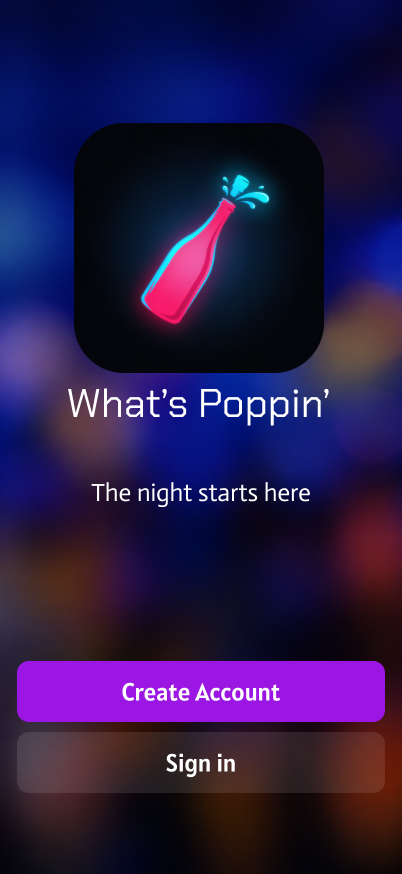
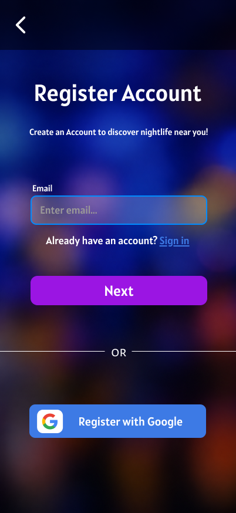
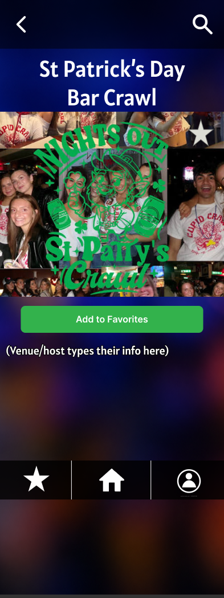
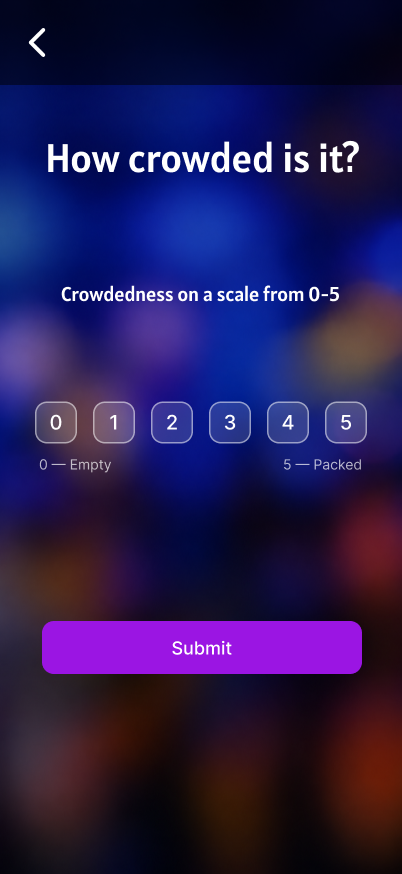
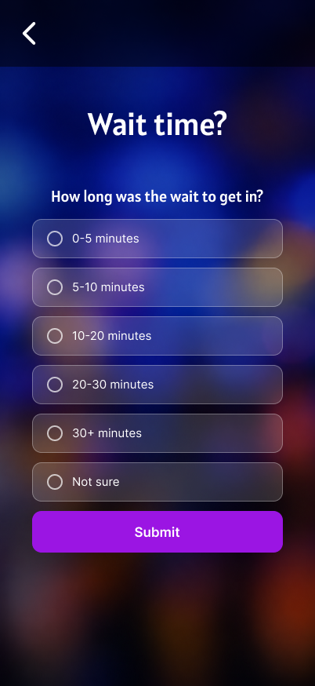
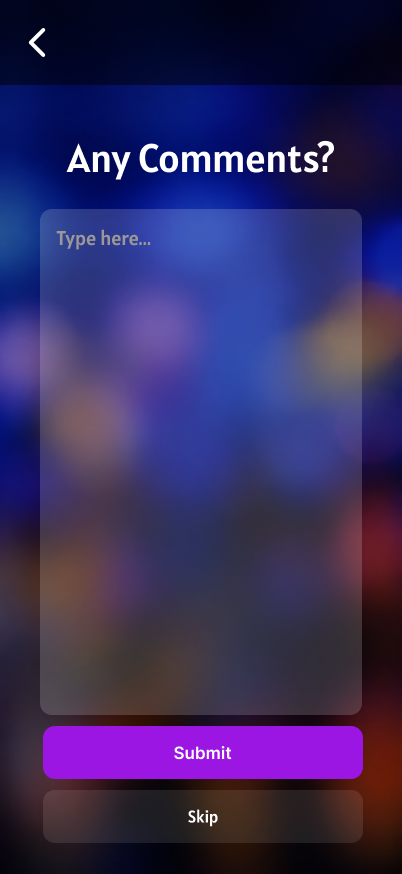
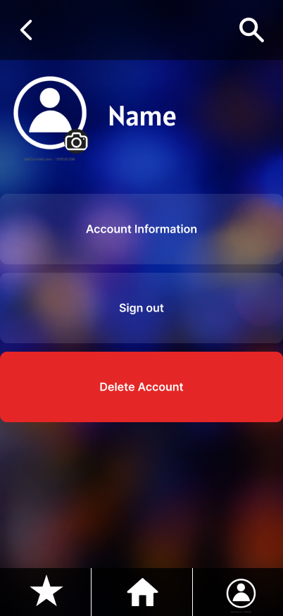

# WhatsPoppin

A mobile app about real-time nightlife discovery for College Park Maryland.

Users will be able to find the perfect place in College Park to spend their night!

## Key features

- Real-time crowd reporting
- Venue discovery
- Events and promotions
- Historical crowd trends
- Venue accounts

## Tech Stack

Frontend:
React Native / Expo

Backend:
Django REST Framework

Database:
PostgreSQL

## UI/UX Design

The initial UI/UX was designed in Figma before development

[View Interactive Figma Prototype](https://www.figma.com/design/jA8Q45vkIckb0IjsxjSkwS/WhatsPoppin-mock-UI?node-id=0-1&t=KleW9YpNphBqFnZo-1)

### Screenshots

Loading Screen


Welcome Page



Authentication Pages



Home Page


Venue Page


Event Page



Favorites Page


Reports pages





Profile page



## Repository structure

```text
WhatsPoppin/
├── backend/          Django project and apps
│   ├── config/       Project settings and URL routing
│   ├── users/        Accounts
│   ├── venues/       Bars and clubs
│   ├── events/       Events at a venue
│   ├── reports/      Crowd and wait-time reports
│   ├── favorites/    Saved venues
│   ├── manage.py
│   └── requirements.txt
├── design/           Figma screen exports
├── frontend/         React Native app (not started)
├── .env.example      Placeholder environment variables
└── .venv/            Local Python virtual environment (not committed)
```

The mobile app is not part of the backend foundation. Screen designs live in `design/`.

## Backend setup

The backend uses Python, Django 5.2, Django REST Framework, and PostgreSQL. Django 5.2 is the long-term support release and works with the Python 3.14 install used for this project.

### Python virtual environment

From the repository root:

```powershell
python -m venv .venv
.\.venv\Scripts\Activate.ps1
```

On macOS or Linux, activate it with `source .venv/bin/activate`.

### Dependency installation

With the virtual environment activated:

```powershell
pip install -r backend\requirements.txt
```

### PostgreSQL configuration

PostgreSQL 18 is already installed on this machine as the `postgresql-x64-18` service. Create a database and login role for the app. The easiest way is pgAdmin. From `psql`, connect as the PostgreSQL admin user and run the statements below.

`psql` is not on the system PATH. On this install it lives here:

```powershell
& "C:\Program Files\PostgreSQL\18\bin\psql.exe" -U postgres -h localhost -d postgres
```

```sql
CREATE USER whatspoppin WITH PASSWORD 'choose-a-password';
CREATE DATABASE whatspoppin OWNER whatspoppin;
```

Use that password only in your local `.env` file.

### .env setup

From the repository root:

```powershell
Copy-Item .env.example .env
```

Edit `.env` and replace every placeholder. `DJANGO_SECRET_KEY` can be any long random string. Generate one with:

```powershell
.\.venv\Scripts\python.exe -c "import secrets; print(secrets.token_urlsafe(50))"
```

`.env` is ignored by Git. `.env.example` contains placeholders only.

### Migration commands

From the `backend` directory, with the virtual environment activated and `.env` filled in:

```powershell
python manage.py migrate
python manage.py seed_dev_data
python manage.py createsuperuser
```

`seed_dev_data` loads fictional College Park sample data. The sample usernames are `sample_alex`, `sample_jordan`, and `sample_riley`. Their shared development password is `sample-password`. These are not real accounts.

### Development server

From the `backend` directory:

```powershell
python manage.py runserver
```

The admin site is at [http://127.0.0.1:8000/admin/](http://127.0.0.1:8000/admin/).

### Test command

From the `backend` directory:

```powershell
python manage.py test
```


